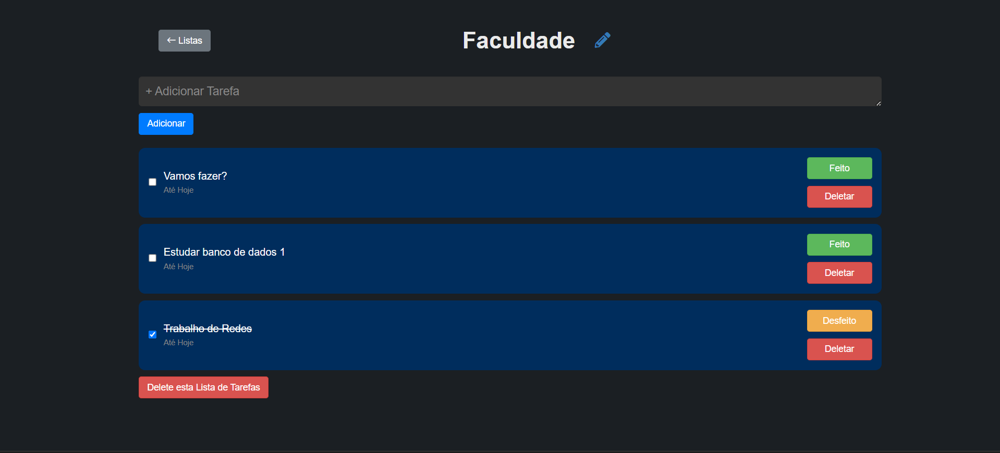
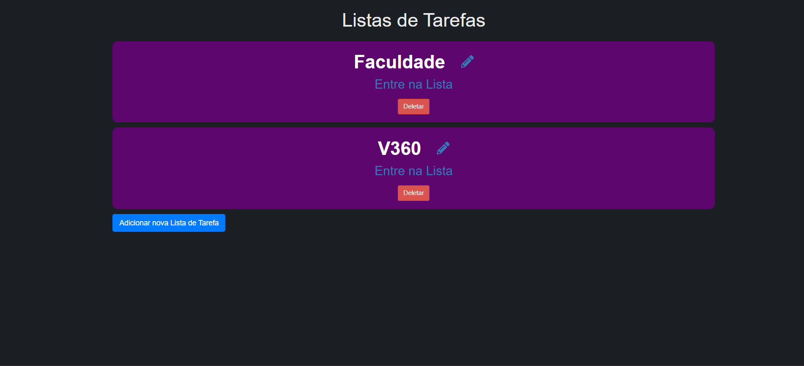

# To-Do List - Desafio Individual V360

Este Repositório apresenta o objetivo de cumprir o desafio individual, sendo o case a criação de um To-Do List. 

O desafio em questão é o seguinte

```` Fazer um TO DO List, onde este, tem que ter no mínimo: ````

1) Poder criar várias listas de TO DO;

2) Cada lista tem que poder ser adicionado vários itens.

Com isso, a organização do desafio foi realizada a partir do GitHub Projects, com a criação de um backlog simples para levar em consideração o que uma lista de tarefas útil deve ter de funcionalidades.

P

Para rodar a aplicação e testar, primeiro faça um **git clone** e depois basta usar no terminal o comando:

```` 
rails s
````

Veja algumas imagens da aplicação:

<center>



Tela de uma Lista
</center>

<center>



Tela de Listas de Tarefa
</center>


